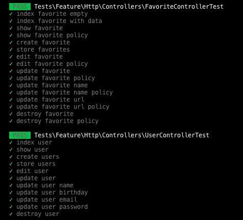
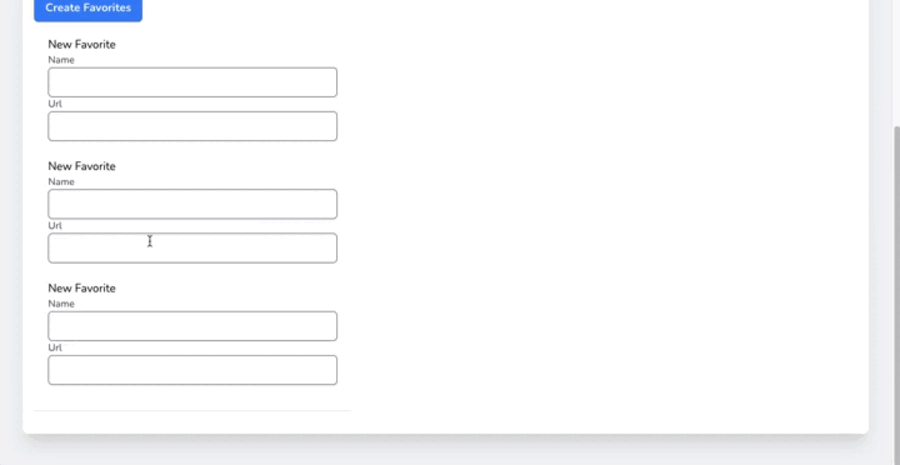
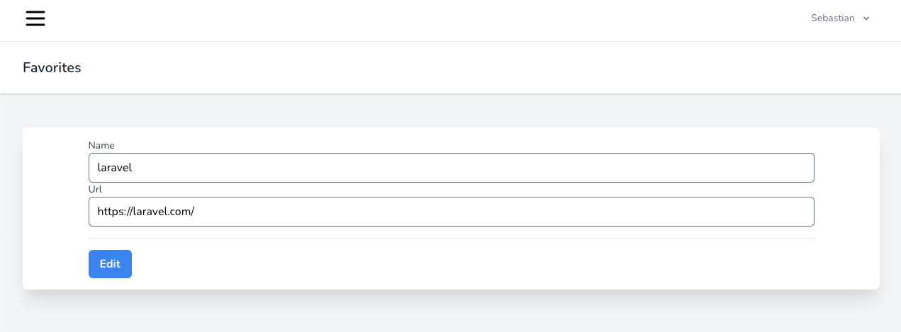
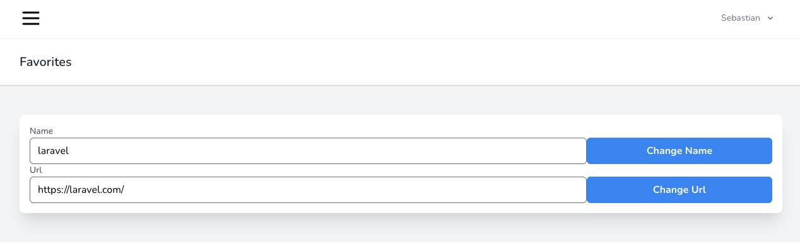
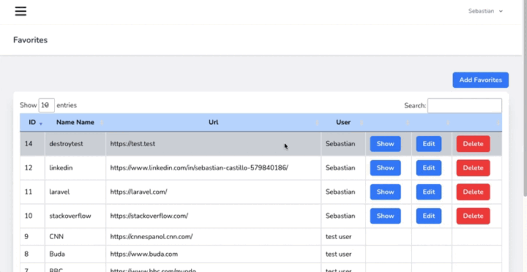
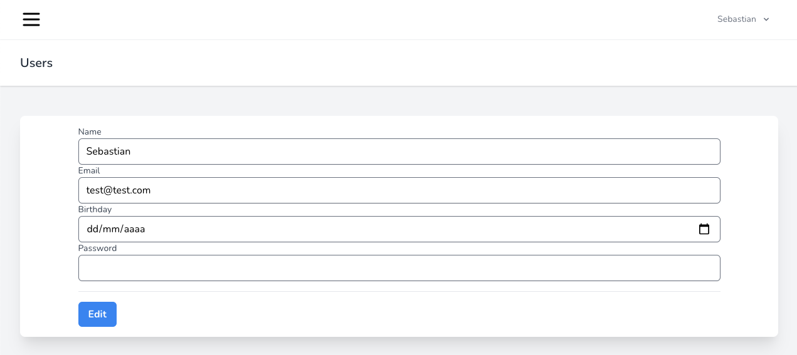
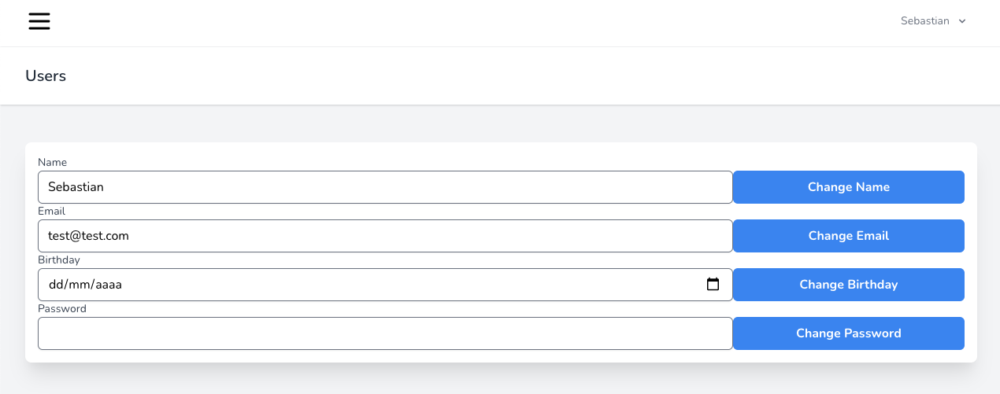
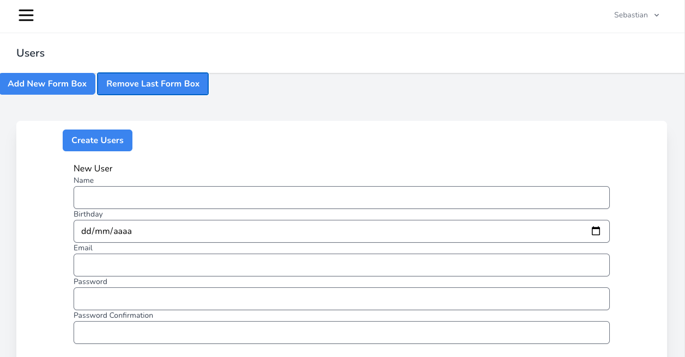

<p align="center"><a href="https://laravel.com" target="_blank"></a></p>

<p align="center">
<a href="https://travis-ci.org/laravel/framework"></a>
<a href="https://packagist.org/packages/laravel/framework"></a>
<a href="https://packagist.org/packages/laravel/framework"></a>
<a href="https://packagist.org/packages/laravel/framework"></a>
</p>

# Welcome to my proyect!

[Español](./README.md)


## Introduction

The project is a Favorite website manager that allows you to create multiple Users and multiple Favorite websites, as well as view other User's Favorites.

It is basically a CRUD, with its corresponding testings.



## Favorites


Favorites View brings up all the User's Favorites.
The search input and the pagination was created with Datatables.
https://datatables.net/

Users can see all the Favorites with the owner name but only the Favorite owner can update it or delete it.

To hide update and delete buttons I just wrote a conditional view.

```php
@if (Auth::user()->id == $favorite->user_id)
    <td class="border px-4 py-2">
        <a href="{{ route('favorites.show', $favorite) }} "
        class="bg-blue-500 text-white font-bold px-4 py-2 rounded-md ">Show</a>
    </td>
    <td class="border px-4 py-2">
        <a href="{{ route('favorites.edit', $favorite) }}"
        class="bg-blue-500 text-white font-bold px-4 py-2 rounded-md ">
        Edit
        </a>
    </td>
    <td class="border px-4 py-2">

        <form action="{{ route('favorites.destroy', $favorite) }}" method="POST">
            @csrf
            @method('DELETE')
            <input type="submit" value="Delete"
            class="bg-red-500 text-white font-bold px-4 py-2 rounded-md">
        </form>
    </td>
@else
    <td class="border px-4 py-2"></td>
    <td class="border px-4 py-2"></td>
    <td class="border px-4 py-2"></td>
@endif
```

### Favorites Creation



The Create view allows the creation of multiple Favorites. The form inputs can be cloned with the "Add new form box" button and can be removed with the "Delete last form box" button.

```html
<form action="{{ route('favorites.store') }}" method="POST" class="max-w-md">
    @csrf
    <input type="submit" value="Create Favorites" class="bg-blue-500 text-white font-bold px-4 py-2 rounded-md ">
    <div class="py-2 px-2" id="create-form-container">
        <div class="py-3 px-3" id="create-form-child">
            <h2>New Favorite</h2>
            <label class="block font-medium text-sm text-gray-700">Name</label>
            <input class="form-input w-full rounded-md shadow-sm" type="text" name="name[]" required>

            <label class="block font-medium text-sm text-gray-700">Url</label>
            <input class="form-input w-full rounded-md shadow-sm" type="text" name="url[]" required>
        </div>
    </div>          
</form>
```

Controller storage method validates array inputs and data is formatted for data insertion

```php
public function store(Request $request)
    {
        $validator = Validator::make($request->all(), [
            "name"    => "required|array",
            "name.*"  => "required",
            "url"    => "required|array",
            "url.*"  => "required",
        ]);
        if (!$validator->fails()) {
            //estructura de filas para el insert
            $data = [];
            foreach ($request->name as $key => $value) {
                $data[$key]['name'] = $value;
            }
            foreach ($request->url as $key => $value) {
                $data[$key]['url'] = $value;
                $data[$key]['user_id'] = Auth::user()->id;
            }
            Favorite::insert($data); 
        }
        return redirect()->route('favorites.index');
    }
```

### Favorites Update

Favorites can be updated in Edit or Show views. In Edit View all input are required while in Show view only one field input is required to update (updateName y updateUrl)

#### Favorites Edit



#### Favorites Show



#### Favorite Update Controller Method

On the controller side, an access policy is enforced so only the Favorites owners can update fields.

```php
public function update(FavoriteRequest $request, Favorite $favorite)
{
    $this->authorize('pass',$favorite);
    $favorite->update($request->all());
    return redirect()->route('favorites.edit', $favorite);
}

public function updateName(Request $request, Favorite $favorite)
{
    $this->authorize('pass',$favorite);
    $request->validate(['name'=>'required']);
    $favorite->update(['name' => $request->name]);
    return redirect()->route('favorites.show', $favorite);
}

public function updateUrl(Request $request, Favorite $favorite)
{
    $this->authorize('pass',$favorite);
    $request->validate(['url'=>'required']);
    $favorite->update(['url' => $request->url]);
    return redirect()->route('favorites.show', $favorite);
}
```

### Favorites Destroy



Soft Deletes is used to delete. Only Favorites owners can delete their Favorite just like the updates.

```php
public function destroy(Favorite $favorite)
{
    $this->authorize('pass',$favorite);
    $favorite->delete();//softDelete
    return redirect()->route('favorites.index');
}
```

## Users


Users Index View is just like the Favorite Index View.

### Users Updates

Users do not have an access policy. I should create a user role or access policy Users management.

#### Users Edit



#### Users Show



### Users Creation



Users Create View is just like Favorites Create View. 

```html
<form action="{{ route('users.store') }}" method="POST" class="max-w-5xl mx-auto">
    @csrf
    <input type="submit" value="Create Users" class="bg-blue-500 text-white font-bold px-4 py-2 rounded-md ">
    <div class="py-2 px-2" id="create-form-container">
        <div class="py-3 px-3" id="create-form-child">
            <h2>New User</h2>
            <label class="block font-medium text-sm text-gray-700">Name</label>
            <input class="form-input w-full rounded-md shadow-sm" type="text" name="name[]" required>

            <label class="block font-medium text-sm text-gray-700">Birthday</label>
            <input class="form-input w-full rounded-md shadow-sm" type="date" name="birthday[]" required>

            <label class="block font-medium text-sm text-gray-700">Email</label>
            <input class="form-input w-full rounded-md shadow-sm" type="email" name="email[]" required>
                            
            <label class="block font-medium text-sm text-gray-700">Password</label>
            <input class="form-input w-full rounded-md shadow-sm" type="password" name="password[]" required>

            <label class="block font-medium text-sm text-gray-700">Password Confirmation</label>
            <input class="form-input w-full rounded-md shadow-sm" type="password" name="password_confirmation[]" required>
        </div>
    </div>
</form>
```

On the controller side storage method validates array inputs and data is formatted for data insertion

```php
public function store(Request $request)
{
    $validator = Validator::make($request->all(), [
        "name"    => "required|array",
        "name.*"  => "required",
        "birthday"    => "required|array",
        "birthday.*"  => "required",
        "email"    => "required|array",
        "email.*"  => "required",
        "password"    => "required|array",
        "password.*"  => "required|string|min:8",
        "password_confirmation"    => "required|array",
        "password_confirmation.*"  => "required|string|min:8",
    ]);
    if (!$validator->fails() && $request->password === $request->password_confirmation) {
        //estructura de filas para el insert
        $data = [];
        foreach ($request->name as $key => $value) {
            $data[$key]['name'] = $value;
        }
        foreach ($request->birthday as $key => $value) {
            $data[$key]['birthday'] = $value;
        }
        foreach ($request->email as $key => $value) {
            $data[$key]['email'] = $value;
        }
        foreach ($request->password as $key => $value) {
            $data[$key]['password'] = Hash::make($value);
        }

        User::insert($data); 
    }

    return redirect()->route('users.index');
}
```

There is also the possibility of registering with Jetstream and Fortify. In this case, I add the Birthday field in the view and Fortify Action.


## License

The Laravel framework is open-sourced software licensed under the [MIT license](https://opensource.org/licenses/MIT).
