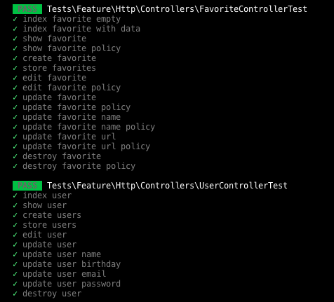
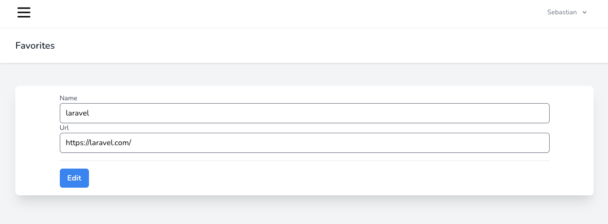
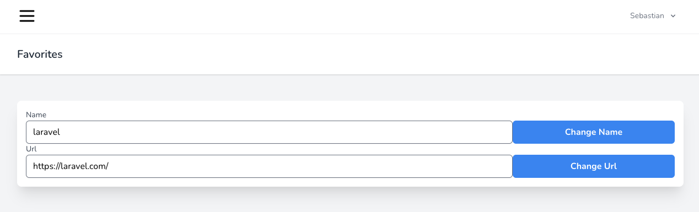
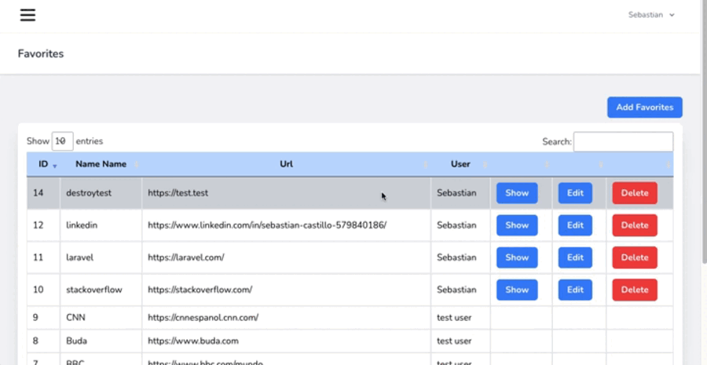
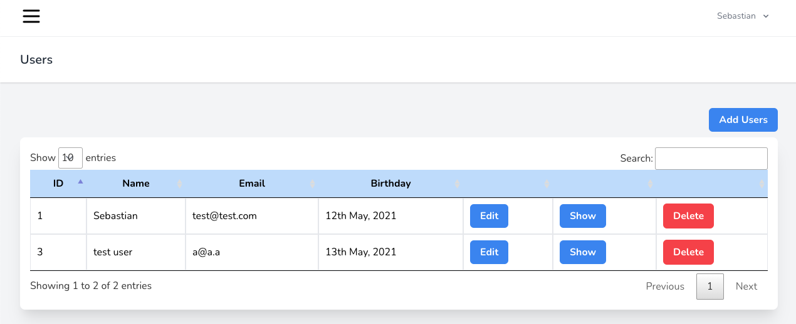
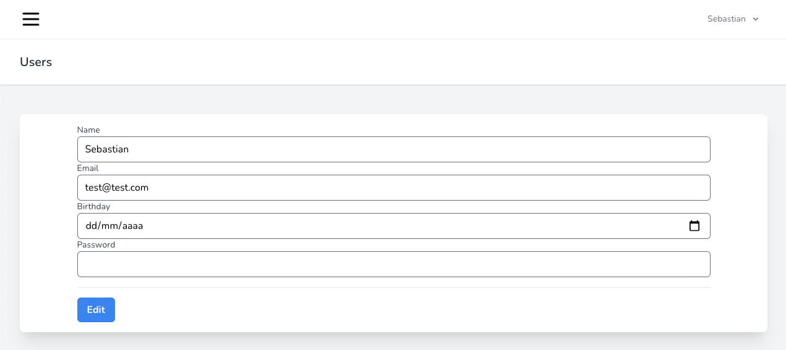
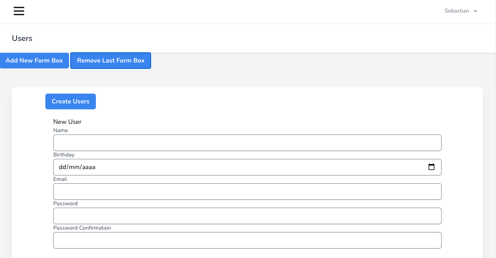
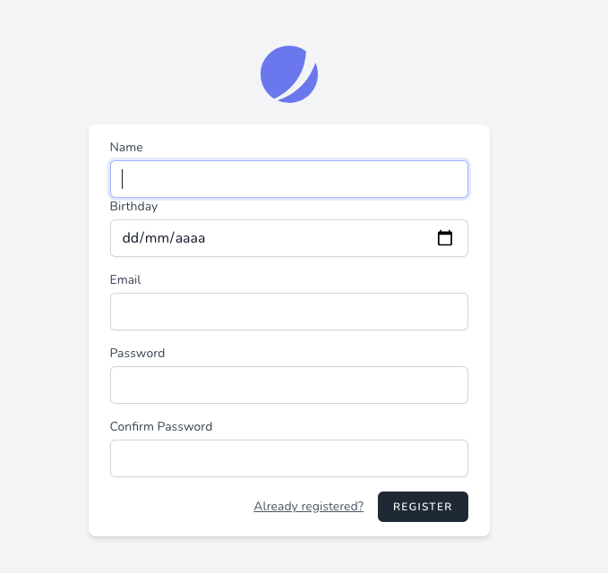

<p align="center"><a href="https://laravel.com" target="_blank"></a></p>

<p align="center">
<a href="https://travis-ci.org/laravel/framework"></a>
<a href="https://packagist.org/packages/laravel/framework"></a>
<a href="https://packagist.org/packages/laravel/framework"></a>
<a href="https://packagist.org/packages/laravel/framework"></a>
</p>

# ¡Bienvenid@s a mi repositorio!


## Introduccion

El proyecto consiste en un sistema que permite a usuarios agregar y administrar sus sitios
favoritos (Favorites), asi como visualizar los favoritos de otros usuarios.

Es básicamente un CRUD respaldado por los test de cada método de los controladores y las políticas de acceso, en el caso de Favorites



## Favorites


La vista Favorites trae los sitios favoritos de todos los usuarios. Para el buscador y la paginación use la libreria JS Datatables.
https://datatables.net/

Los usuario pueden ver todos los favoritos, asi como el nombre del usuario que agregó ese favorito, pero solo el dueño del favorito puede modificarlo o eliminarlo.

A nivel de vista, el ocultamiento del botón para los no dueños lo trabajé con un simple if en el archivo blade

```php
@if (Auth::user()->id == $favorite->user_id)
    <td class="border px-4 py-2">
        <a href="{{ route('favorites.show', $favorite) }} "
        class="bg-blue-500 text-white font-bold px-4 py-2 rounded-md ">Show</a>
    </td>
    <td class="border px-4 py-2">
        <a href="{{ route('favorites.edit', $favorite) }}"
        class="bg-blue-500 text-white font-bold px-4 py-2 rounded-md ">
        Edit
        </a>
    </td>
    <td class="border px-4 py-2">

        <form action="{{ route('favorites.destroy', $favorite) }}" method="POST">
            @csrf
            @method('DELETE')
            <input type="submit" value="Delete"
            class="bg-red-500 text-white font-bold px-4 py-2 rounded-md">
        </form>
    </td>
@else
    <td class="border px-4 py-2"></td>
    <td class="border px-4 py-2"></td>
    <td class="border px-4 py-2"></td>
@endif
```

### Favorites Creation


La vista create permite la creación de múltiples favoritos. Contiene un formulario con un div que se clona al clickear el botón "Add New Form Box". Asi mismo se pueden eliminar los "Form Box" clickeando "Remove Last Form Box".
Los campos name de los input reciben un array con los valores ingresados. Luego el valor del índice indica a que favorito corresponde.

```html
<form action="{{ route('favorites.store') }}" method="POST" class="max-w-md">
    @csrf
    <input type="submit" value="Create Favorites" class="bg-blue-500 text-white font-bold px-4 py-2 rounded-md ">
    <div class="py-2 px-2" id="create-form-container">
        <div class="py-3 px-3" id="create-form-child">
            <h2>New Favorite</h2>
            <label class="block font-medium text-sm text-gray-700">Name</label>
            <input class="form-input w-full rounded-md shadow-sm" type="text" name="name[]" required>

            <label class="block font-medium text-sm text-gray-700">Url</label>
            <input class="form-input w-full rounded-md shadow-sm" type="text" name="url[]" required>
        </div>
    </div>          
</form>
```

En el lado del controlador, se validan los arrays, y se estructuran los datos para la inserción.
El campo user_id del favorito toma por defecto el id del usuario que está creando el favorito. Si se quisieran crear favoritos para otros usuarios habría que agregar user_id al request, además de crear un select con los user_id (capaz con un componente livewire)

```php
public function store(Request $request)
    {
        $validator = Validator::make($request->all(), [
            "name"    => "required|array",
            "name.*"  => "required",
            "url"    => "required|array",
            "url.*"  => "required",
        ]);
        if (!$validator->fails()) {
            //estructura de filas para el insert
            $data = [];
            foreach ($request->name as $key => $value) {
                $data[$key]['name'] = $value;
            }
            foreach ($request->url as $key => $value) {
                $data[$key]['url'] = $value;
                $data[$key]['user_id'] = Auth::user()->id;
            }
            Favorite::insert($data); 
        }
        return redirect()->route('favorites.index');
    }
```

En este punto se podrían plantear varias mejoras, como aislar el código de la validación y ser mas restrictivo (agregar mas validaciones además del simple required)

### Favorites Update

La actualización de registros se puede hacer, a traves de la vista Edit y Show.
La diferencia es que Edit requiere rellenar todos los campos, mientras que Show, permite la actualización de un campo individual.
La vista Edit envía los datos al método update, mientras que Show envía los datos a los métodos de cada campo (updateName y updateUrl)

#### Favorites Edit



#### Favorites Show



#### Favorite Update Controller Method

Del lado del controlador se aplica una política de acceso para que solo los dueños de los favoritos puedan modificar.

```php
public function update(FavoriteRequest $request, Favorite $favorite)
{
    $this->authorize('pass',$favorite);
    $favorite->update($request->all());
    return redirect()->route('favorites.edit', $favorite);
}

public function updateName(Request $request, Favorite $favorite)
{
    $this->authorize('pass',$favorite);
    $request->validate(['name'=>'required']);
    $favorite->update(['name' => $request->name]);
    return redirect()->route('favorites.show', $favorite);
}

public function updateUrl(Request $request, Favorite $favorite)
{
    $this->authorize('pass',$favorite);
    $request->validate(['url'=>'required']);
    $favorite->update(['url' => $request->url]);
    return redirect()->route('favorites.show', $favorite);
}
```

### Favorites Destroy



Los registros de borran con Soft Delete.
Al igual que en los updates, solo el dueño del favorito puede eliminar su favorito

```php
public function destroy(Favorite $favorite)
{
    $this->authorize('pass',$favorite);
    $favorite->delete();//softDelete
    return redirect()->route('favorites.index');
}
```

## Users



La vista Users Index funciona igual a la de Favorites. Tiene un buscador y paginación.
Al igual que en Favorites, se pueden editar los usuario desde la vista Edit (todos los campos) o Show (campos individuales).

### Users Updates

En el caso de los usuarios, no hay politica de acceso. Cualquiera puede agregar, editar o eliminar otros usuario. Esto es una posible mejora a revisar. Quizas se podría generar una politica de acceso, como en el caso de los favoritos, o la posibilidad de gestionar accesos por roles de usuarios (por ejemplo que solo el admin pueda modificar y eliminar).
Los deletes tambien funcionan con Soft Delete en el caso de los usuarios.

#### Users Edit



#### Users Show


### Users Creation



Los usuarios tienen la misma lógica de creación masiva que los favoritos. Se pueden clonar los inputs para crear mas usuarios y la información se envía en forma de array inputs

```html
<form action="{{ route('users.store') }}" method="POST" class="max-w-5xl mx-auto">
    @csrf
    <input type="submit" value="Create Users" class="bg-blue-500 text-white font-bold px-4 py-2 rounded-md ">
    <div class="py-2 px-2" id="create-form-container">
        <div class="py-3 px-3" id="create-form-child">
            <h2>New User</h2>
            <label class="block font-medium text-sm text-gray-700">Name</label>
            <input class="form-input w-full rounded-md shadow-sm" type="text" name="name[]" required>

            <label class="block font-medium text-sm text-gray-700">Birthday</label>
            <input class="form-input w-full rounded-md shadow-sm" type="date" name="birthday[]" required>

            <label class="block font-medium text-sm text-gray-700">Email</label>
            <input class="form-input w-full rounded-md shadow-sm" type="email" name="email[]" required>
                            
            <label class="block font-medium text-sm text-gray-700">Password</label>
            <input class="form-input w-full rounded-md shadow-sm" type="password" name="password[]" required>

            <label class="block font-medium text-sm text-gray-700">Password Confirmation</label>
            <input class="form-input w-full rounded-md shadow-sm" type="password" name="password_confirmation[]" required>
        </div>
    </div>
</form>
```

Del lado del controlador están las validaciones y estructuración del array para el insert.
En este punto, tengo que admitir que hice un poco de trampa en la validación, porque la confirmación del password se hace verificando que los arrays de passwords sean exactamente iguales. Otra mejora a revisar, además del hecho de que sería mejor aislar el coódigo de la validación...

```php
public function store(Request $request)
{
    $validator = Validator::make($request->all(), [
        "name"    => "required|array",
        "name.*"  => "required",
        "birthday"    => "required|array",
        "birthday.*"  => "required",
        "email"    => "required|array",
        "email.*"  => "required",
        "password"    => "required|array",
        "password.*"  => "required|string|min:8",
        "password_confirmation"    => "required|array",
        "password_confirmation.*"  => "required|string|min:8",
    ]);
    if (!$validator->fails() && $request->password === $request->password_confirmation) {
        //estructura de filas para el insert
        $data = [];
        foreach ($request->name as $key => $value) {
            $data[$key]['name'] = $value;
        }
        foreach ($request->birthday as $key => $value) {
            $data[$key]['birthday'] = $value;
        }
        foreach ($request->email as $key => $value) {
            $data[$key]['email'] = $value;
        }
        foreach ($request->password as $key => $value) {
            $data[$key]['password'] = Hash::make($value);
        }

        User::insert($data); 
    }

    return redirect()->route('users.index');
}
```

Por otro lado, tambien está la posibilidad de registrarse con Jetstream y Fortify. En este caso, incorporé el campo Birthday para el registro



## License

The Laravel framework is open-sourced software licensed under the [MIT license](https://opensource.org/licenses/MIT).
