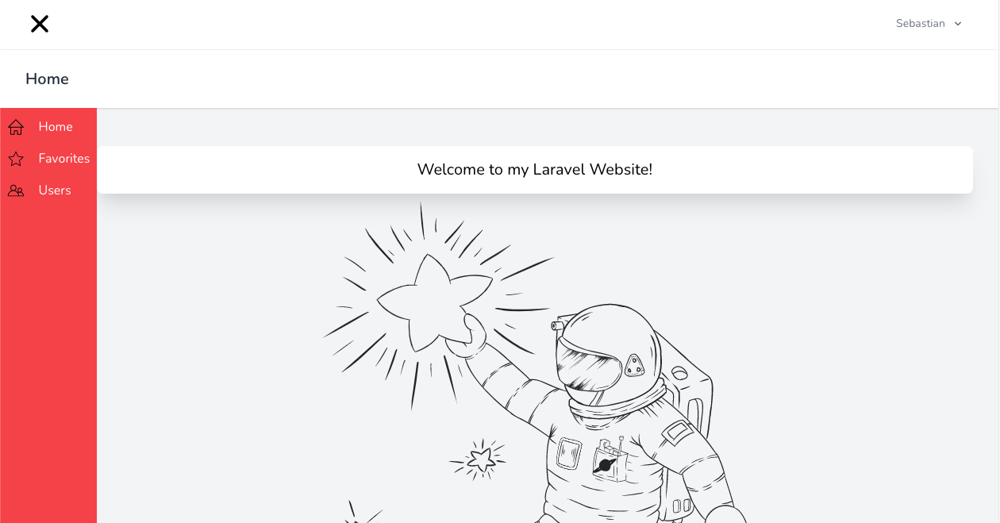
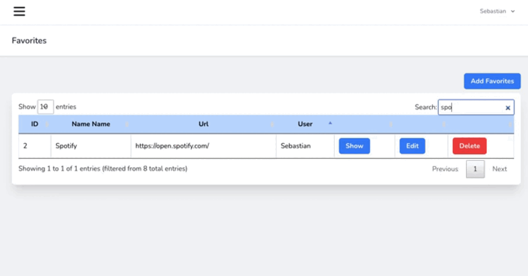
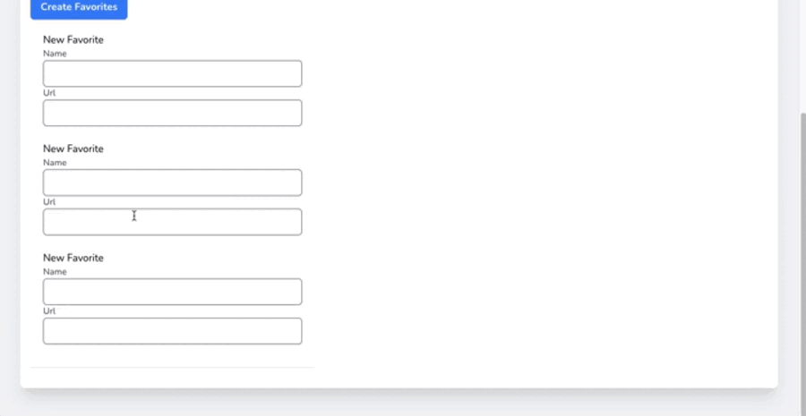

<p align="center"><a href="https://laravel.com" target="_blank"></a></p>

<p align="center">
<a href="https://travis-ci.org/laravel/framework"></a>
<a href="https://packagist.org/packages/laravel/framework"></a>
<a href="https://packagist.org/packages/laravel/framework"></a>
<a href="https://packagist.org/packages/laravel/framework"></a>
</p>

# ¡Bienvenid@s a mi repositorio!



## Introduccion

El proyecto consiste en un sistema que permite a usuarios agregar y administrar sus sitios
favoritos (Favorites), asi como visualizar los favoritos de otros usuarios.

## Favorites


La vista Favorites trae los sitios favoritos de todos los usuarios. Para el buscador y la paginación use la libreria JS Datatables.
https://datatables.net/

Los usuario pueden ver todos los favoritos, asi como el nombre del usuario que agrego ese favorito, pero solo el dueño del favorito puede modificarlo o eliminarlo.

A nivel de vista, el ocultamiento del boton para los no dueños lo trabaje con un simple if en el archivo blade

```php
@if (Auth::user()->id == $favorite->user_id)
    <td class="border px-4 py-2">
        <a href="{{ route('favorites.show', $favorite) }} "
        class="bg-blue-500 text-white font-bold px-4 py-2 rounded-md ">Show</a>
    </td>
    <td class="border px-4 py-2">
        <a href="{{ route('favorites.edit', $favorite) }}"
        class="bg-blue-500 text-white font-bold px-4 py-2 rounded-md ">
        Edit
        </a>
    </td>
    <td class="border px-4 py-2">

        <form action="{{ route('favorites.destroy', $favorite) }}" method="POST">
            @csrf
            @method('DELETE')
            <input type="submit" value="Delete"
            class="bg-red-500 text-white font-bold px-4 py-2 rounded-md">
        </form>
    </td>
@else
    <td class="border px-4 py-2"></td>
    <td class="border px-4 py-2"></td>
    <td class="border px-4 py-2"></td>
@endif
```

### Favorites Creation



La vista create permite la creacion de multiples favoritos. Contiene un formulario con un div que se clona al clickear el boton "Add New Form Box". Asi mismo se pueden eliminar los "Form Box" clickeando "Remove Last Form Box".
Los campos name de los input reciben un array con los valores ingresados. Luego el valor del índice indica a que favorito corresponde.

```html
<div class="py-2 px-2" id="create-form-container">
    <div class="py-3 px-3" id="create-form-child">
        <h2>New Favorite</h2>
        <label class="block font-medium text-sm text-gray-700">Name</label>
        <input class="form-input w-full rounded-md shadow-sm" type="text" name="name[]" required>

        <label class="block font-medium text-sm text-gray-700">Url</label>
        <input class="form-input w-full rounded-md shadow-sm" type="text" name="url[]" required>
    </div>
</div>
```

En el lado del controlador, se validan los arrays, y se estructuran los datos para la inserción.

```php
public function store(Request $request)
    {
        $validator = Validator::make($request->all(), [
            "name"    => "required|array",
            "name.*"  => "required",
            "url"    => "required|array",
            "url.*"  => "required",
        ]);
        if (!$validator->fails()) {
            //estructura de filas para el insert
            $data = [];
            foreach ($request->name as $key => $value) {
                $data[$key]['name'] = $value;
            }
            foreach ($request->url as $key => $value) {
                $data[$key]['url'] = $value;
                $data[$key]['user_id'] = Auth::user()->id;
            }
            Favorite::insert($data); 
        }
        return redirect()->route('favorites.index');
    }
```

En este punto se podrian plantear varias mejoras, como aislar el codigo de la validación y ser mas restrictivo (agregar mas validaciones además del simple required)

## License

The Laravel framework is open-sourced software licensed under the [MIT license](https://opensource.org/licenses/MIT).
